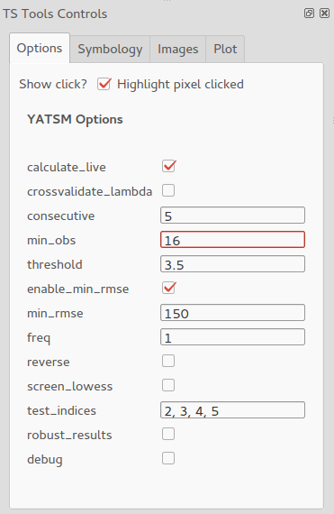
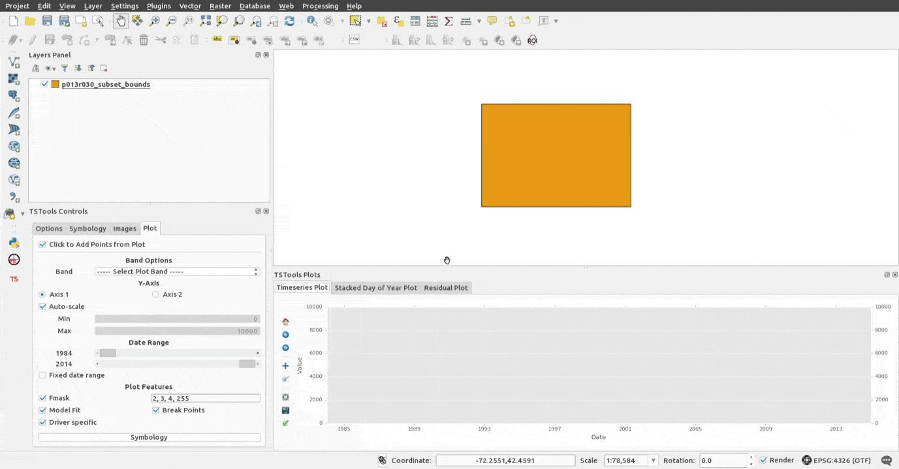
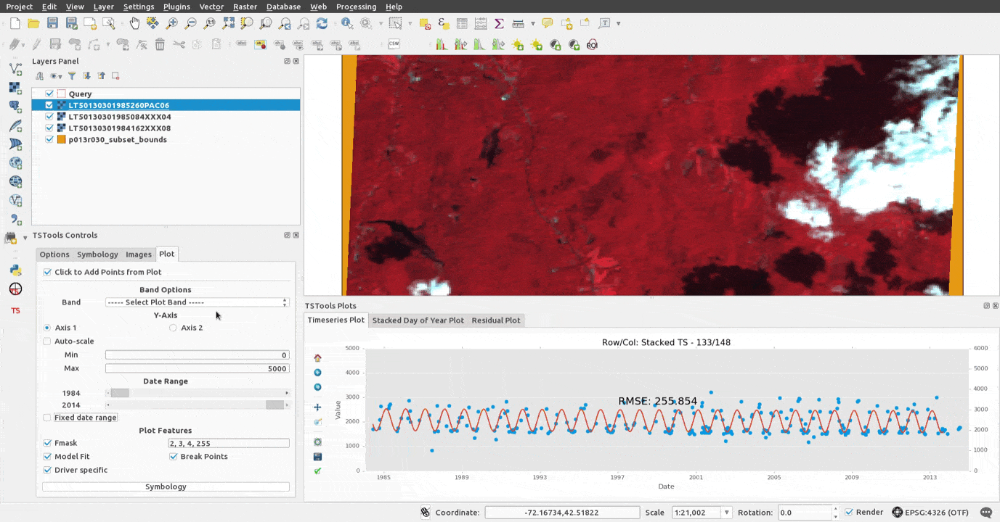

Timeseries Tools (TSTools) Quickstart
-------------------------------------

This quickstart does not cover installation, but instead describes and shows what is possible using the plugin using some examples from this [example dataset](https://github.com/ceholden/landsat_stack).

For installation instructions, please see the [README of this repository](../README.md). These instructions detail how to install a built version of TSTools into your QGIS plugins folder, or how to load a Virtual Box machine image with all of the software preconfigured for demonstration.

## Dataset

Currently the only supported dataset structure is a timeseries containing "layer stacked" images. All images within this "stacked" dataset must have the same geographic extent and all image bands must be within one single file. There are plans to support other types of dataset structures, including datasets with heterogeneous image extents or with image data spread across multiple files.

An example dataset that conforms to the specifications required by the existing timeseries "drivers" can be downloaded [here](https://github.com/ceholden/landsat_stack).

## Initialize a timeseries driver

This plugin uses "drivers" or "handlers" of specific timeseries applications that interface with the user interface. These drivers may require unique information to initialize them and are used by the plugin to retrieve information such as image filenames, timeseries data, or model fits. Drivers for CCDC have already been implemented, but other algorithms such as LandTrendr or BFAST could be visualized within TSTools if drivers were developed to handle their datasets and model results.

In the example below, I initialize a timeseries driver for "Yet Another TimeSeries Model" (YATSM), an algorithm implemented in Python based on CCDC, by locating the directory containing the timeseries data.

This timeseries driver not only can read in results calculated in "batch" for an entire dataset, but users can experiment live with model parameters using a series of forms on the "Options" tab:

The pairing between model parameters and the user interface widgets was almost automatic. The timeseries driver only had to specify a list of variables and default values to be used. The datatype of these default values controls what type of widget will be generated.

## Add timeseries images and control symbology

The "Images" tab of the TSTools Control Panel contains a listing of all images found within the selected directory. A click of a checkbox will add any one of the images to be visualized within QGIS.

To facilitate comparison among images, the "Symbology" tab controls the Red-Green-Blue symbology for every image added through the plugin. Minimum and maximum image values can be mapped to 0 and 255 and all image contrast stretching techniques are available as well.

## Plot timeseries across years

Once an image has been added from the timeseries, the TSTools Click Tool will retrieve and plot the timeseries for any pixel the user clicks.

In this example, I compare a Landsat 5 image from 1993 with an anniversary image from Landsat 8 in 2014 by toggling back and forth. I notice an area of forest regrowth along a river and retrieve the timeseries to investigate.

The first band plotted was the first band in the dataset - the blue band. This band is quite noisy, but a long downward regrowth trend can be seen in the second timeseries segment (green line). This regrowth signature is even more pronounced when switching to the first shortwave-infrared band.

The algorithm results can be turned on or off to help assess without bias whether the model successfully captures patterns visible in the timeseries.

## Plot timeseries within a year

To help assess whether or not the timeseries break detected by the algorithm is correct, the X-axis can be manipulated to increase plot resolution by decreasing the amount of data plotted. I begin by subsetting the plot to just the data within the first time period.

The "Stacked Day of Year Plot" is a very useful visualization for representing variation in reflectance from phenology (and illumination). The X axis no longer contains information across years -- this information is instead visualized as a progression from blue (earlier) to red (later).

The pre-disturbance observations are shown in blue and cyan. By adding data after the disturbance occurred, I begin to see yellow and orange points appear much further below the blue and cyan points. These yellow and orange points correspond to the image data immediately following the disturbance. It is now clear that some disturbance occurred which caused a drop in the shortwave-infrared reflectance. By adding the rest of the points to the graph, I see that there is a negative trend in reflectance after the initial disturbance.

## Point to Image

Timeseries can be very informative when trying to infer the history of a pixel. Probably the best feature in this plugin is the ability to tie these timeseries observations on either graph back to the corresponding images. 

Clicking any point in either the "Time Series Plot" or the "Stacked Day of Year Plot" will add the corresponding image to QGIS list of displayed layers. In this example, I trace the anomaly detected in the timeseries to what looks like a large flooding event.

Points that are drawn on top of or very close to other points may be difficult to add if the clickable buffers overlap. In these circumstances, decrease the amount of data plotted on the X or Y axis to increase the distance among the points.

## Ancillary data

The TSTools plugin is built on top of QGIS, an excellent Geographic Information System program. Ancillary data from shapefiles, geospatial databases, rasters, or web resources are easily importable into QGIS. The very same plugin infrastructure that allows TSTools to exist allows enables others to create powerful utilities.

One such utility is the ["OpenLayers Plugin"](https://github.com/sourcepole/qgis-openlayers-plugin) which can display basemaps of high-resolution satellite imagery from sources including Google and Bing.

## Plot Symbology

A very simplistic and primitive symbology engine has been implemented for the "Time Series Plot". Timeseries drivers can define variables to be used as plot symbology and the plugin will setup symbology controls for these values. Users can also add their own categorical metadata by opening a CSV file containing columns of metadata and a column used for a match index (e.g., the image ID or image date).

Here I show a quick example which distinguishes observations from Landsat TM, ETM+, or OLI:

There is no planned support for mapping continuous variables to categorical labels within the interface, but driver can handle this if needed. This feature has been very helpful when used to plot observations removed during CCDC from the multitemporal cloud and shadow screening algorithm - "TMask".
